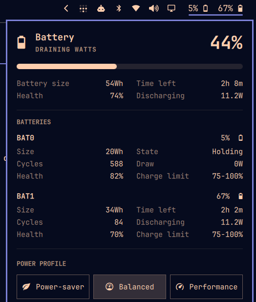

# Batteries

Every battery on the bar, for laptops that carry more than one pack.


Omarchy's built-in power widget reads `UPower.displayDevice` — the *aggregate*
of every pack — and its manifest sets `allowMultiple: false`, so a second
instance cannot be added and no instance can be pointed at a specific battery.
On a ThinkPad with Power Bridge that means a single number covering two cells
that are frequently nowhere near each other: the internal one can sit at 5%
while the bay battery is at 67%, and the bar just says 44%.

This plugin replaces that widget. It keeps everything the original does —
the aggregate hero, the progress bar, the power profile picker, the keybinding —
and adds a readout and a stat block for each physical pack.



## What it shows

On the bar, one entry per pack, in sysfs order:

```
5% 󰁺  67% 󰂁
```

In the panel, the aggregate summary on top, then per pack:

| Field | Source |
|---|---|
| Level and icon | UPower, per device |
| Size | `energyCapacity` (energy-full) |
| Cycles | sysfs `cycle_count` |
| Health | energy-full ÷ energy-full-design |
| Time left / Time to full | UPower `timeToEmpty` / `timeToFull` |
| Draw | `changeRate` |
| Charge limit | sysfs `charge_control_*_threshold` |

Live values come from UPower and update reactively. Cycle count, design
capacity and charge thresholds are not in Quickshell's `UPowerDevice` API, so a
small bundled helper (`battery-packs`) reads them from sysfs, refreshed on the
same 5-second tick the panel already uses while open.

The charge limit column reflects whatever wrote the thresholds — TLP, a vendor
tool, or the firmware — without shelling out to `tlp-stat`.

## Requirements

- Omarchy 4.0+ (the Quickshell shell — this does not apply to the Waybar era)
- One or more batteries. With a single pack it behaves exactly like the
  built-in widget, so it is safe on any laptop.

## Install

```bash
omarchy plugin add https://github.com/cinco/omarchy-batteries.git --enable
omarchy restart shell
```

That is the whole install. The manifest declares
`omarchy.clonedFrom: "omarchy.power"`, so enabling this plugin takes the
built-in widget's slot in the bar and disables it — no manual swap, and any
`showPercentage` you had set carries over. The two are mutually exclusive by
design; you cannot end up with both on the bar by following this.

To place it somewhere else:

```bash
omarchy bar move cinco.batteries --section right
```

## Configuration

The bar entry in `~/.config/omarchy/shell.json`:

```json
{ "id": "cinco.batteries", "showPercentage": true }
```

- `showPercentage` — `true` shows `5% 󰁺  67% 󰂁`, `false` shows icons only.
  Right-click the widget to toggle it; the choice is written back to
  `shell.json`.

## Compatibility with the built-in widget

The same `clonedFrom` declaration makes Omarchy's `resolveEnabledId` route
calls aimed at the built-in widget here. Everything that addressed the power
panel keeps working:

- `SUPER + CTRL + P` — `omarchy-shell shell toggle omarchy.power`
- The menu's Battery Percentage item — `omarchy-shell omarchy.power togglePercentage`

The plugin also answers on its own target:

```bash
omarchy-shell cinco.batteries toggle
omarchy-shell cinco.batteries togglePercentage
```

## Uninstall

```bash
omarchy plugin remove cinco.batteries
omarchy restart shell
```

Removal restores `omarchy.power` to its slot on its own, for the same reason
installing displaced it.

## Notes

Vertical bars fall back to the aggregate icon — two readouts do not fit a 28px
column.

A pack moving no current is reported as idle regardless of the state it
advertises. On a Power Bridge machine only one pack charges or drains at a
time, and the idle one sits in `pending-charge`; without that handling the
panel would promise a "time to full" for a battery doing nothing.

## Credits

`Panel.qml` and `Model.js` are derived from the `omarchy.power` plugin in
[Omarchy](https://github.com/basecamp/omarchy) by Basecamp, MIT licensed.
Because they are a fork, upstream improvements to the power panel do not arrive
automatically — open an issue if you spot the drift.

MIT. See [LICENSE](LICENSE).
